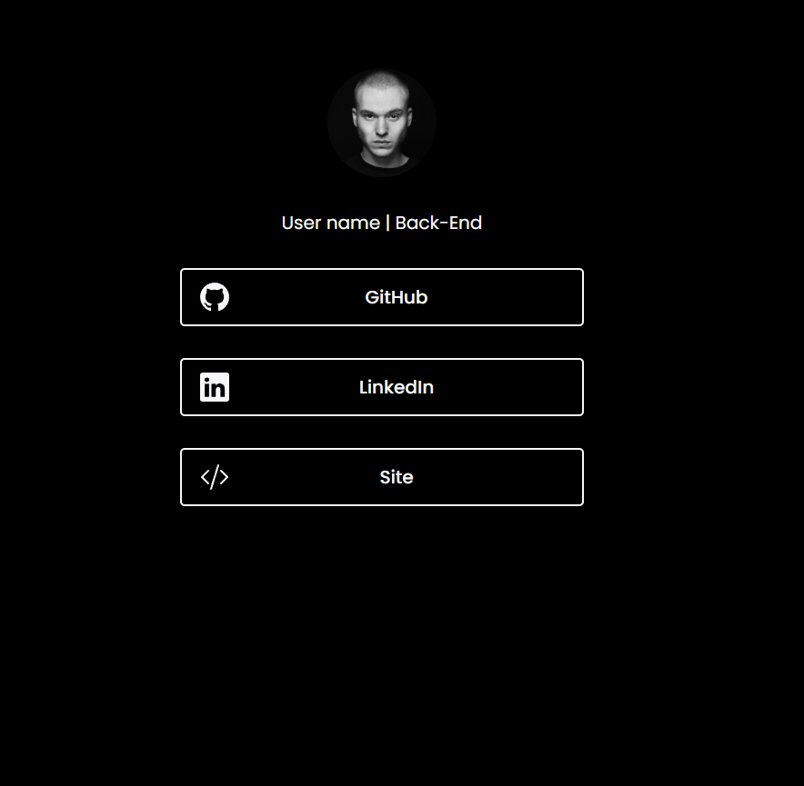

# 🌟 LinkTree 
Aplicação simples, do tipo Linktree, desenvolvida em HTML e CSS. Permite organizar e personalizar links em uma interface minimalista e responsiva, ideal para perfis pessoais e portfólios. O objetivo é ser uma aplicação simples, de fácil alteração e personalização.

# ✨ Funcionalidades:
- Design responsivo: Layout amigável para dispositivos móveis, que se adapta a diferentes tamanhos de tela.
- Links personalizáveis: Adicione, remova ou modifique links com facilidade, conforme suas necessidades.
- Interface simples: Design limpo e intuitivo, garantindo fácil navegação.
- Leve: Construído com tecnologias web básicas, garantindo tempos de carregamento rápidos.
  
# 🌝 Como Começar:
Para usar ou modificar esta aplicação, basta clonar o repositório e abrir os arquivos index.html e style.css. Em seguida, faça as alterações de cores e links conforme desejar.
